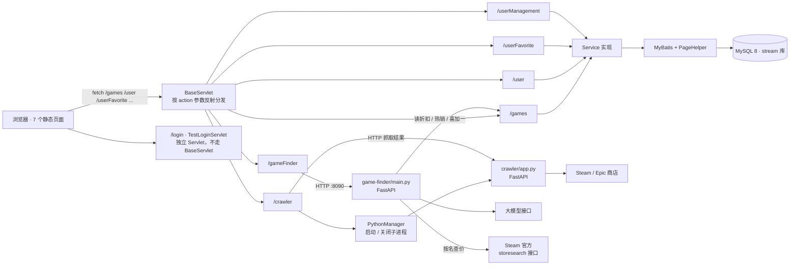

# Stream 游戏信息平台（GameStream）

一个 Java Web 单体应用：抓取 Steam / Epic 的折扣与热销数据落到 MySQL，前端提供折扣列表、热销榜、喜加一、收藏、用户管理，另有一个基于大模型的「AI 导购助手」。

课程期末作业，原项目目录名 `ex_final_stream`，这里保留了原来的 WAR 名以免与 `web.xml`、部署说明不一致。

## 界面预览

截图待补。拍好后放进 `docs/screenshots/`，再把下表「截图」一列换成图片引用
（形如 ``），GitHub 上就会直接渲染。

| 页面 | 文件 | 截图 |
| --- | --- | --- |
| 首页 | `src/main/webapp/index.html` | 待补 → `docs/screenshots/01-home.png` |
| 游戏商城（折扣 / 热销 / 喜加一 / 搜索） | `src/main/webapp/games_list.html` | 待补 → `docs/screenshots/02-shop.png` |
| AI 导购助手 | `src/main/webapp/game_finder.html` | 待补 → `docs/screenshots/03-game-finder.png` |
| 个人中心（我的收藏） | `src/main/webapp/user_home.html` | 待补 → `docs/screenshots/04-profile.png` |
| 登录 / 注册 | `src/main/webapp/login.html` | 待补 → `docs/screenshots/05-login.png` |
| 爬虫控制台 | `src/main/webapp/crawler_control.html` | 待补 → `docs/screenshots/06-crawler.png` |
| 管理员面板 | `src/main/webapp/admin_panel.html` | 待补 → `docs/screenshots/07-admin.png` |

## 技术栈

| 层次 | 用了什么 |
| --- | --- |
| 后端 | Java 8、Servlet 4.0（`javax.servlet`）、`HttpServlet` + 反射做 action 分发 |
| 持久层 | MyBatis 3.5（XML Mapper）、PageHelper 分页、MySQL 8 |
| 前端 | 原生 HTML / CSS / JavaScript，无构建步骤 |
| 爬虫微服务 | Python 3 + FastAPI + BeautifulSoup（`crawler/`） |
| AI 导购助手微服务 | Python 3 + FastAPI + OpenAI 兼容接口，外部数据来自 Steam 官方 `storesearch` 接口与本应用自己的 `/games`，口碑走 DuckDuckGo 搜索（`game-finder/`） |
| 构建 | Maven（`war`） |
| 部署 | Tomcat 9.x（8.5 也能跑，见「环境要求」） |

## 架构

单仓库，Java Web 模块在仓库根，两个 Python 微服务作为平级目录。



一次「刷新折扣数据」的完整链路：

1. 浏览器请求 `/crawler?action=startSteamDiscount`
2. `CrawlerServlet` 调 `CrawlerServiceImpl`，后者先让 `PythonManager` 把 `crawler/app.py` 拉起来
3. 通过 HTTP 调爬虫的 `/steam/discount` 接口，分页取回游戏折扣 JSON
4. 逐条写进 `games` 表（`ON DUPLICATE KEY UPDATE`，同一平台的同一游戏 ID 会更新而不是插重复行）
5. 关掉爬虫子进程，把成功条数用 `Result` 包好返回前端

爬虫这个微服务的端口是**真正统一**的：`PythonManager` 启动它时用 `crawler.port`，调用它时 `CrawlerServiceImpl` 用同一个值，并且把这个值作为 `CRAWLER_PORT` 传给子进程，Python 侧直接读它，一改全改。AI 助手那个微服务不由 Java 启动（是双击脚本或手动起的），所以没有这种自动传递：两边靠**同一个键名**对齐——Java 侧读 `game-finder.port` / `GAME_FINDER_PORT`，Python 侧读 `.env` 里的 `GAME_FINDER_PORT`，**两处必须填一致**；不一致的表现是页面上报「微服务未启动」。

**AI 助手这边多一条反向的边**：它的 `browse_deals` 工具要回头调本应用的 `/games` 读榜单，所以 `.env` 里的 `STREAM_BASE_URL` 必须指向真正在跑的 Java 应用。方向变成了：Java 转发请求给助手，助手再回调 Java。这个环是刻意的——助手要能说「这个折扣榜里哪几款值得买」，就得读商城里那份榜单，不然就会出现「助手推荐了折扣页里根本没有的游戏」。填错的表现是：助手问「最近有什么好价」时会如实说「连不上应用」，而不是编一堆推荐出来。

## 后端接口一览

两类入口：6 个功能 Servlet 走统一入口，用 `?action=<方法名>` 分发（`BaseServlet` 反射调用同名方法）；另有 1 个独立的 `TestLoginServlet`（`/login`），直接继承 `HttpServlet`，不参与这套分发。

| 入口 | action | 说明 |
| --- | --- | --- |
| `/games` | `getGamesByPage` | 分页查询（PageHelper） |
| | `getAllGames` | 取全部（不分页，返回列表） |
| | `getAllByDiscount` / `getAllByTopSeller` | 按折扣顺序 / 热销榜顺序取全部 |
| | `searchByGnameDiscount` / `searchByGnameTopSeller` | 按游戏名模糊搜索 |
| | `getGiveawayGames` | 喜加一（限时免费 + 即将免费） |
| | `getGameById` / `addGame` / `updateGame` / `deleteGame` | 单条增删改查 |
| `/user` | `login` / `register` | 登录 / 注册 |
| | `getById` / `getAll` / `searchByNick` | 查询 |
| | `update` / `updateProfile` / `delete` | 修改与删除 |
| `/userFavorite` | `getMyFavorites` / `add` / `delete` / `isFavorited` | 收藏 |
| `/userManagement` | `getAllUsers` / `addUser` / `updateUser` / `deleteUser` | 管理员面板用 |
| `/crawler` | `startSteamDiscount` / `startSteamTopSeller` / `startEpicFreeGames` | 手动触发爬虫 |
| | `checkAndTriggerWeekly` | 判断今天是不是周一，是就在后台顺序跑三个爬虫 |
| `/gameFinder` | `findGame` / `healthCheck` | 转发给 AI 导购助手微服务 |
| `/login` | （无 action） | 早期留下来的一套独立登录接口，直接继承 `HttpServlet`，响应格式也自成一套，见「已知问题」 |

数据统一用 `Result{code, message, data}` 包装（用户管理那几个接口用的是另一套 `{status, count, data}`，见「已知问题」）。

## 环境要求

| 依赖 | 版本 |
| --- | --- |
| JDK | 8 |
| Maven | 3.6+ |
| MySQL | 8.0 |
| Tomcat | 9.x（建议）；8.5 也能跑 |
| Python | 3.8+（只有爬虫和 AI 助手需要） |

**Tomcat 建议用 9.x，但不是必须。** 卡住版本的是 servlet 规范这一层：本项目用的是 `javax.servlet`，**8.5 和 9.x 都跑得起来**，而 Tomcat 10 起换成了 `jakarta.servlet`，部署上去会 404。8.5 实测过：8.5.20 能完整跑通（首页、`/games`、`/user`、`/gameFinder` 都验过），只多一行警告——`web.xml` 声明的是 Servlet 4.0，8.5 只到 3.1，Tomcat 自己降级处理，不影响功能。建议 9.x 是因为 8.5 这条线 2024 年 3 月就停止维护了，不是因为它跑不了。

## 快速开始

### 1. 建库

```bash
mysql -uroot -p < sql/schema.sql
mysql -uroot -p < sql/seed.sql
```

`schema.sql` 建出 `stream` 库和三张表；`seed.sql` 灌一批虚构演示数据，可以重复执行，不会覆盖库里已有的行。

### 2. 配置数据库

二选一，**环境变量优先**：

* 环境变量：`DB_URL` / `DB_USER` / `DB_PASSWORD`（可选 `DB_DRIVER`）
* 或者把 `src/main/resources/db.properties.example` 复制成同目录下的 `db.properties` 再填真实值

`db.properties` 已被 `.gitignore` 排除，不会被提交。两项都没配时，第一次访问数据库会抛出明确提示，指出缺了哪几项、以及上面这两种配法。

### 3. 构建

```bash
mvn clean package
```

产出 `target/ex_final_stream.war`。

### 4. 部署运行

把 WAR 放进 Tomcat 的 `webapps/`，启动后打开：

```text
http://localhost:8080/ex_final_stream/index.html
```

演示账号（来自 `seed.sql`）：

| 账号 | 口令 | 说明 |
| --- | --- | --- |
| `alice` | `demo123456` | 普通用户，有两条收藏 |
| `admin` | `demo123456` | 用户名必须是 `admin` 才能进管理员面板 |

### 5. 爬虫与 AI 助手（可选）

两个 Python 微服务都不是启动应用的必需品：不启动它们，商城的浏览、搜索、收藏功能照常可用，只有「爬虫控制台」和「AI 导购助手」会报「微服务未启动」。

**爬虫**由 Java 侧自动拉起（点爬虫控制台里的按钮时），只需先装好依赖：

```bash
cd crawler
python -m pip install -r requirements.txt
copy .env.example .env
```

`.env` 里填访问 Steam / Epic 用的代理（`CRAWLER_PROXY`，留空表示直连）。

用 Tomcat 部署时要多配一步：`crawler/` 目录不会被打进 WAR，而 `python.crawler.workdir` 的默认值 `crawler`
是**相对 JVM 的工作目录**解析的，Tomcat 的 JVM 工作目录是 `CATALINA_HOME/bin`，在那里找不到 `crawler`，
爬虫按钮会返回 0 条。给个绝对路径即可（`%REPO%` 指放这个项目的目录）：

```bat
set PYTHON_CRAWLER_WORKDIR=%REPO%\crawler
```

日志里会打印出它实际解析成的绝对路径，对不上时照着改。用 `mvn` 直接跑或把 WAR 解到仓库根目录下运行时，
相对路径就是对的，不用配。

**AI 导购助手**用根目录的 `start_game_helper.bat` 启动（双击即可），或手动：

```bash
cd game-finder
python -m pip install -r requirements.txt
copy .env.example .env
python main.py
```

它回答三类问题，各对应一个工具：

| 用户问什么 | 走哪个工具 | 数据从哪来 |
| --- | --- | --- |
| 「艾尔登法环现在多少钱」 | `search_game` | Steam 官方 `store.steampowered.com/api/storesearch`，纯 JSON |
| 「最近有什么好价 / 大家在买什么 / 有什么免费的」 | `browse_deals` | 本应用的 `/games`，与商城页面上看到的是同一份数据 |
| 「某某口碑怎么样」 | `search_reviews` | DuckDuckGo 实时搜索，查询词由工具侧拼好 |

三个工具平级，按用户意图选用，没有「必须先用哪个」的先后。助手只把工具返回的价格、折扣、评分写进回答，查不到就说查不到。

`.env` 里要填两项：

* `DEEPSEEK_API_KEY`——任何兼容 OpenAI 接口的服务都可以，不限于示例里的那家
* `STREAM_BASE_URL`——本应用的地址，带 context path，默认 `http://localhost:8080/ex_final_stream`。**只有 `browse_deals` 用它**，填错不影响另外两个工具，但问「有什么好价」时会得到一句「连不上应用」

因此助手的可用性和应用是绑在一起的：页面由 Java 提供，能看到这个页面就说明应用在场；但要回答榜单类问题，应用必须**正在运行**、且库里有数据（跑过爬虫、或灌过 `seed.sql`）。

国内网络下 `pip` 慢的话可以加镜像：`python -m pip install -r requirements.txt -i https://mirrors.aliyun.com/pypi/simple/`。

## 配置项一览

`src/main/resources/app.properties`（不含任何密钥，随仓库出行）：

| 配置项 | 默认值 | 环境变量覆盖 | 说明 |
| --- | --- | --- | --- |
| `python.executable` | 空 | `PYTHON_EXE` | Python 解释器；留空表示用 PATH 上的 `python` |
| `python.crawler.workdir` | `crawler` | `PYTHON_CRAWLER_WORKDIR` | 爬虫工作目录。相对路径相对 **JVM 的工作目录**解析（不是仓库根）；用 Tomcat 部署时 JVM 工作目录是 `CATALINA_HOME/bin`，必须改用环境变量给绝对路径，见下方「启动步骤」第 5 步 |
| `crawler.port` | `8099` | `CRAWLER_PORT` | 爬虫微服务端口，Java 启动与调用两侧共用 |
| `game-finder.port` | `8090` | `GAME_FINDER_PORT` | AI 助手微服务端口 |

数据库连接（`DB_URL` / `DB_USER` / `DB_PASSWORD` / `DB_DRIVER`，或本地 `db.properties`）见上文第 2 步。

## 推送前的隐私扫描

仓库根目录的 `privacy_scan.py` 会检查**一次提交会包含的所有文件**（工作树里没被 `.gitignore` 排除的文本文件），
命中密码、密钥、连接串、个人信息或本机绝对路径时，列出 `文件:行号: 规则` 并以非零退出码结束：

```bash
python privacy_scan.py          # 扫描当前目录
python privacy_scan.py <目录>   # 扫描别处
```

它不回显命中的具体内容，所以报告可以随便粘贴。运行前不需要先 commit——它按 `.gitignore` 判断文件范围，
本仓库是在 `git init` 之前就先跑过它的（结果：零命中）。

想让每次 `git push` 自动先扫一遍，把下面两行写进 `.git/hooks/pre-push`。hook 不在版本控制里，每个克隆都要各自装一次：

```sh
#!/bin/sh
exec python privacy_scan.py
```

**第一行不能省。** 实测：只写 `exec python privacy_scan.py` 时，Windows 上的 git 会尝试把 hook 当可执行文件启动，
报 `error: cannot spawn .git/hooks/pre-push: No such file or directory` 并直接拒绝推送。装上之后命中即中止推送。

## 项目结构

```text
stream-game-platform/
├── pom.xml                     Maven 构建（war）；Java 模块保持在仓库根
├── src/main/java/com/stream/
│   ├── servlet/                6 个功能 Servlet（由 BaseServlet 按 action 分发）+ 1 个独立的 TestLoginServlet
│   ├── service/ + service/impl 业务实现
│   ├── mapper/                 MyBatis Mapper 接口
│   ├── pojo/                   实体类（Lombok 生成 getter/setter）
│   ├── crawler/                手动冒烟测试入口
│   └── utils/                  AppConfig / DbConfig / MybatisUtil / PythonManager / Result
├── src/main/resources/
│   ├── app.properties          端口与 Python 路径（不含密钥）
│   ├── db.properties.example   数据库模板；真实配置走环境变量或本地 db.properties
│   ├── mybatis-config.xml      连接信息由 DbConfig 解析后注入
│   └── mapper/                 3 个 XML Mapper
├── src/main/webapp/            7 个静态页面 + 样式
├── crawler/                    Python 爬虫微服务（Steam / Epic）
├── game-finder/                Python AI 导购助手微服务
├── sql/                        建库脚本与虚构示例数据
├── docs/screenshots/           截图目录
├── privacy_scan.py             推送前的隐私扫描
└── start_game_helper.bat       Windows 下启动 AI 导购助手
```

## 已知问题与后续计划

这一节是刻意写全的：下面每一条都是我自己知道的坑，而不是等别人来发现。

**做错了或还没做的**

1. **口令明文存储。** `user` 表的 `password` 字段存的是明文，登录时直接拿 SQL 比对字符串。应该改成加盐哈希（bcrypt / Argon2）。
2. **没有服务端鉴权。** `/userManagement` 下的接口任何人都能调用；管理员面板只是在前端判断 `username === 'admin'`，绕过前端就能改任意用户。需要给服务端加会话或令牌，并在服务端校验角色。
3. **注册与登录没有防护。** 没有验证码、没有限流、没有失败次数锁定。
4. **三套响应格式并存。** 多数接口用 `Result{code, message, data}`，用户管理用的是 `{status, count, data}`，`/login` 又是 `{code, msg, user}`。前端要分别处理，应该统一成一套。
5. **`TestLoginServlet` / `/login` 是早期遗留。** 功能和 `/user?action=login` 重复，类的名字里还带着 `Test`，响应格式也和别处不一样。应该删掉或合并进 `UserServlet`。
6. **HTTP 状态码恒为 200。** 出错只体现在响应体里，客户端和监控都看不出异常。
7. **爬虫依赖第三方页面结构。** Steam / Epic 一改版解析就会失败，目前只打印日志，没有告警也没有重试。
8. **周同步标记存在内存里。** `checkAndTriggerWeekly` 用一个静态变量记录「今天同步过没有」，Tomcat 重启就丢，重启后当天再点一次会重复同步。
9. **`Demo.java` 不是生产代码。** 它只是一个手动冒烟测试入口，用来确认 Python 解释器和端口配对了。
10. **前端没有工程化。** 原生 HTML/JS，没有构建、没有模块化，几个页面之间有不少重复代码。
11. **没有任何自动化测试。** 后端、前端、Python 微服务都没有测试，改动全靠手点。
12. **模糊搜索用不上索引。** `gname LIKE '%x%'` 前面带通配符，走不了索引；数据量大了需要全文索引或搜索引擎。
13. **AI 导购助手的三个工具各有一种坏法。** `search_game` 用的 `store.steampowered.com/api/storesearch` 是 Steam **未文档化**的公开端点，不是给第三方用的正式 API——官方改字段或关掉它，这个工具就失效，而且现在只会表现为回答里说「查不到」，没有告警；它对中文名的匹配也时好时坏（「黑神话：悟空」能中，「黑神话悟空」「只狼」中不了），所以提示词里让模型查空后换英文名再试一次。`browse_deals` 是三个里唯一读自家数据的，它的坏法不是「别人改版」而是「应用不在场」——它读本应用自己的 `/games`，所以依赖 Java 应用**正在运行**、且库里有数据：空库里只有 `seed.sql` 那几条演示数据，问「有什么好价」它就会推荐这几条（名字价格像模像样，但是虚构的）；而且爬虫只收折扣 / 热销 / 喜加一三类，「最近有什么新品 / 即将推出」它答不了。`search_reviews` 走 DuckDuckGo 的 html 端点并自己解析结果页，同样是未文档化的页面结构，改了就要跟着改解析。
14. **用 Tomcat 部署时，`crawler/` 目录要在仓库外单独保留。** 它不会被打进 WAR，`PythonManager` 靠 `PYTHON_CRAWLER_WORKDIR` 找到它；不配的话爬虫按钮会静默返回 0 条（日志里有一行明确的「工作目录不存在」）。
15. **三段爬虫代码几乎逐行重复。** 折扣 / 热销 / Epic 三个方法各自重复了一遍「HTTP 取数 → 解析 JSON → 落库」，差异只在 URL 和字段映射。应该抽出公共骨架，每段只留自己那点不同。

**后续计划**

* 加服务端鉴权与口令哈希（优先级最高，现在这样不能上生产）
* 统一响应格式与 HTTP 状态码，并清掉 `/login` 这个早期遗留入口
* 抽出三段爬虫的公共骨架
* 给爬虫加失败重试、结果校验和告警
* 补接口层的集成测试（最值得先补的是这一层）
* 前端重写为 Vue 3 + Vite，与本人其他项目保持一致

## 许可

MIT，见 [LICENSE](LICENSE)。